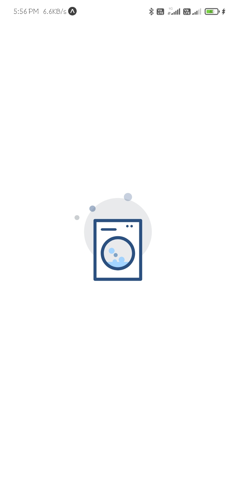
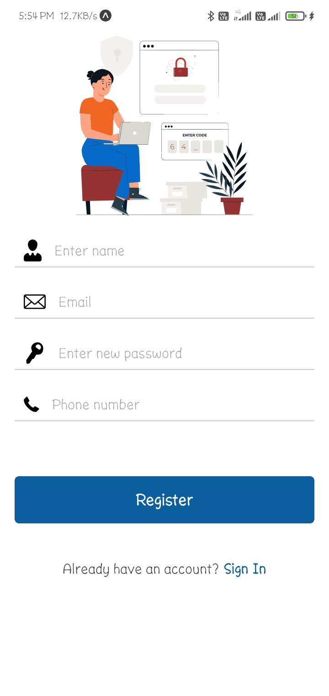
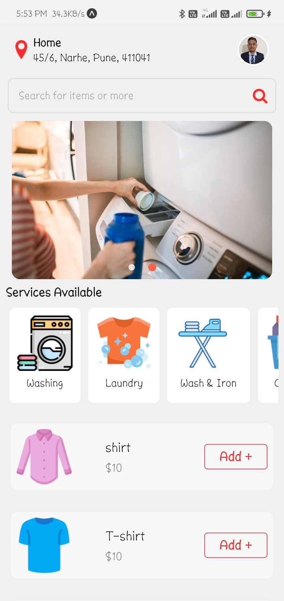
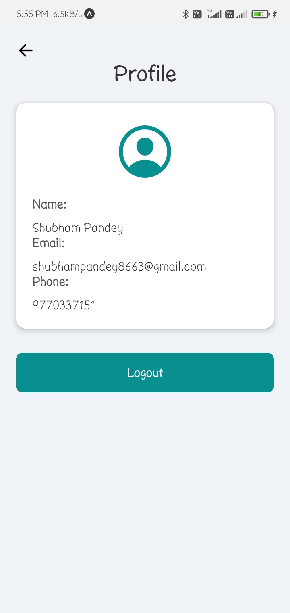
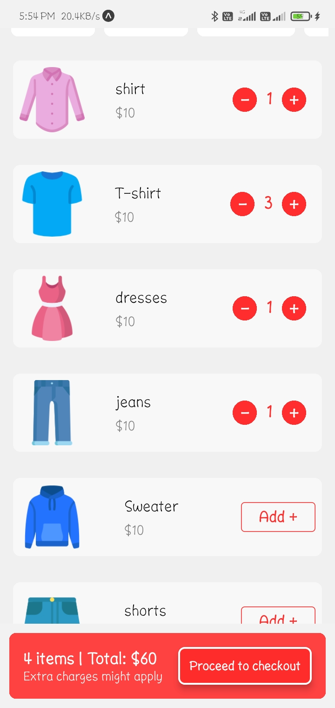
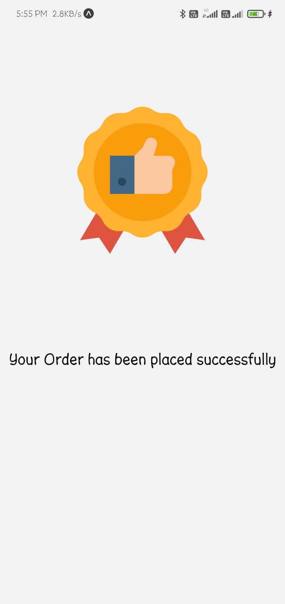

# Laundry Application

## Introduction

The Laundry Application is a mobile app designed to simplify the process of managing laundry services. Users can easily locate nearby laundry services, browse available services, and place orders for laundry pickup and delivery. The app provides a seamless experience with real-time location tracking, a user-friendly interface, and secure payment options.

## Features

- **Location Services**: Automatically fetches and displays the user's current location.
- **Search Functionality**: Allows users to search for specific laundry items or services.
- **Carousel Display**: Showcases featured services and promotions.
- **Service Listings**: Displays a list of available laundry services with images and prices.
- **Cart Management**: Users can add items to their cart and view the total cost.
- **Order Placement**: Facilitates the process of placing an order for laundry pickup and delivery.
- **User Profile**: Displays user profile information and allows for profile image updates.
- **Navigation**: Easy navigation to different screens within the app, including the checkout process.

## Information

The Laundry Application is developed using the latest technologies to ensure a smooth and efficient user experience. It is compatible with both Android and iOS platforms.

## Dependencies

- **React Native**: For building the mobile application.
- **Redux**: For state management.
- **React Navigation**: For handling navigation within the app.
- **Axios**: For making HTTP requests.
- **Firebase**: For authentication and real-time database.
- **Stripe**: For secure payment processing.

## Screenshots

Here are some screenshots of the Laundry Application:

### Splash Screen

### Register

### Home Screen

### Pickup

### Profile

### Select Item

### Your Bucket

### Order Placed

